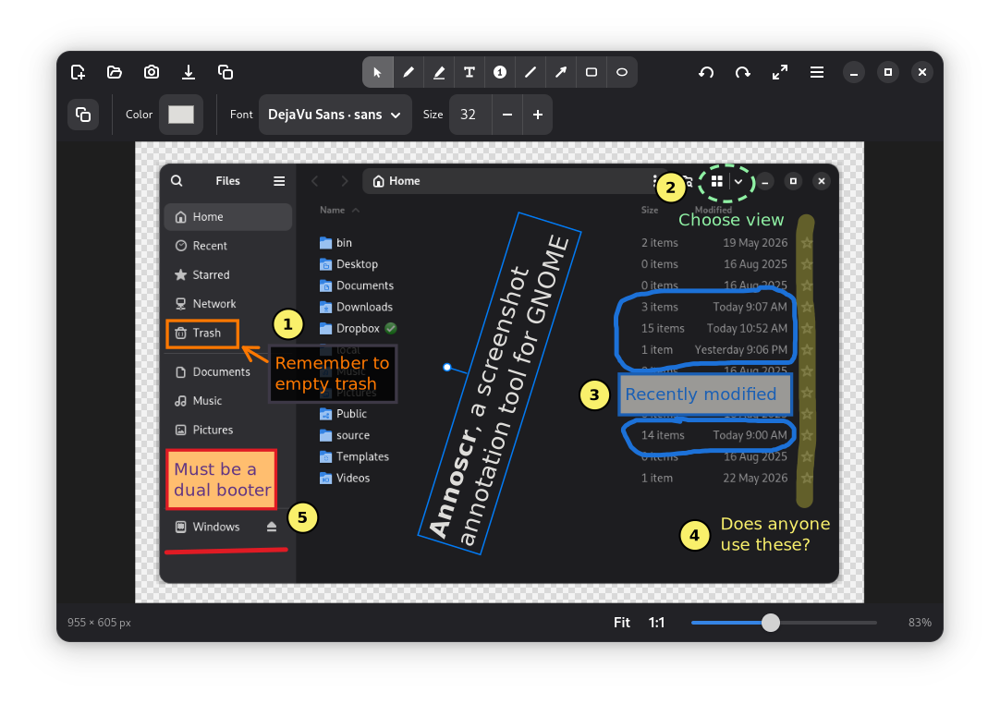

# Annoscr

Annoscr is a lightweight screenshot annotation tool for GNOME.



## Features

- **Annotation tools**: Select, Pen, Text, Line, Arrow, Rectangle, Oval, Highlighter, and a Number stamp, on an icon toolbar with tooltips.

- **Styling**
  - Color and fill: type a hex value, drag the opacity slider, open the full palette, or pick a color from the image with the eyedropper (a magnifier follows the pointer for pixel-accurate picks; Esc cancels).
  - Stroke width, line style (solid / dashed / dotted), arrowheads (open or filled), and rounded rectangle corners.
  - Text color, font, size, and alignment; a text fill (rounded corner backing plate, transparent by default) keeps lettering legible over busy images.
  - Remembered styles: each tool's defaults update when you create or restyle an annotation, so the next one matches.

- **Selecting and editing**
  - Click to select an annotation, Shift+Click to add or remove several, or drag a box across empty canvas to select everything fully inside it; Ctrl+A selects all and Esc clears the selection. Then move, delete, duplicate, restack, or restyle them together.
  - Resize a line, arrow, rectangle, oval, or stamp by its handles; rotate a text, stamp, rectangle, or oval with its gizmo
    - Rectangles and ovals can be constrained to squares and circles, respectively.
    - Lines and arrows can be constrained to 15° angle increments.
    - Rotations can be constrained to 15° increments.
  - Re-edit a text annotation by double-clicking it.
  - Dig through stacked annotations.
  - Undo / redo throughout.
  - Discard confirmation of unsaved changes on exit.

- **Text labels**: give a rectangle or oval a centered caption; the text wraps to the box, aligns left / center / right, and rotates with the shape.

- **Callouts**: flip the Callout switch on a selected rectangle or oval to fuse a pointer tail into its border, then drag the tail's tip to aim it at whatever the box is describing. Combined with a text label, the shape becomes a speech bubble; the tail follows the shape's fill, line style, and rotation.

- **Number stamps**: numbered or lettered per group. Pick or reassign a stamp's group from the style bar, start a new group, and select a stamp to quickly identify all others in the group (if multiple groups exist).

- **Transforms**: rotate the whole image, or resize to crop or expand the canvas.

- **Image I/O**: open a file, paste, drag-and-drop, start a blank canvas, or capture a screenshot through the desktop portal; export to PNG / JPEG or copy back to the clipboard.

- **Annotation files**: save an editable `.annoscr` file (the canvas image plus your annotations) from the primary menu, then reopen it later to add, change, or remove annotations.

- **View**: Fit-to-window, 1:1, or a continuous zoom slider from 25% to 400%; when zoomed in, right-click and drag to pan the canvas.

- **Keyboard & accessibility**: the canvas is keyboard-drivable (pan, walk, select, nudge, resize, rotate, and edit most annotations without the mouse), and every control carries an accessible label for screen readers. The complete shortcut list lives in the in-app reference (primary menu → Keyboard Shortcuts). Drawing new annotations with the keyboard is not yet possible.

- **Preferences** (saved to `~/.config/annoscr/settings.json`): color scheme, default tool at launch, remember tool styles between sessions, default save folder and format, saving images without a location prompt, confirm before discarding, select-after-placement, close-after-saving/copying, and an undo-memory budget; the font list offered in the text menu is editable too. The primary menu also holds a keyboard-shortcuts reference and About.

## Requirements

Annoscr targets **GNOME 46** and newer. The floors are set by the newest APIs it calls:

- **GTK ≥ 4.14**: accessibility (`Gtk.Accessible.announce`, `Gtk.AccessibleList`)
- **libadwaita ≥ 1.5**: `Adw.AlertDialog`, `Adw.Dialog`, `Adw.PreferencesDialog`
- **GJS ≥ 1.72**: ESM `gi://` imports

It also loads GdkPixbuf 2, Pango / PangoCairo, and libportal (for screenshot capture), all of which have far older floors satisfied by any system meeting the above. By distribution:

| Distribution | Minimum           |
| ------------ | ----------------- |
| Debian       | 13 (trixie)       |
| Ubuntu       | 24.04 LTS         |
| Fedora       | 40                |
| Arch         | current (rolling) |

The Debian and Fedora packages declare these versions as dependencies, so a too-old system is refused at install time rather than failing at runtime.

**Screenshot capture** goes through the XDG desktop portal, so it needs the `xdg-desktop-portal` service and a screenshot-capable backend (e.g. `xdg-desktop-portal-gnome`) running, present by default on GNOME. This is an optional dependency since everything else (open, paste, drag-and-drop, blank canvas) works without it. The display server is irrelevant: the portal is the standard capture path on both Wayland and X11.

## Installing

Pre-built, signed packages for Debian/Ubuntu, Fedora, and Arch are on the [releases page](https://github.com/mdmower/annoscr/releases). Download the one for your distribution, [verify it](#verifying-downloads), then install:

```sh
# Debian / Ubuntu
sudo apt install ./annoscr_1.3.0_all.deb

# Fedora / openSUSE
sudo dnf install ./annoscr-1.3.0-1.fc41.noarch.rpm

# Arch (import the signing key first; see Verifying downloads)
sudo pacman -U ./annoscr-1.3.0-1-any.pkg.tar.zst
```

To build from source instead, see [CONTRIBUTING.md](CONTRIBUTING.md).

### apt repository (Debian / Ubuntu)

For automatic updates, add the CMPhys apt repository rather than downloading the `.deb` from the releases page. First, add the signing key (the same `CMPhys Releases` key that signs every release):

```sh
sudo install -d -m 0755 /etc/apt/keyrings
sudo curl -fsSL https://repo.cmphys.com/cmphys-releases.gpg \
  -o /etc/apt/keyrings/cmphys-releases.gpg
```

Then, create `/etc/apt/sources.list.d/cmphys.sources`, setting `Suites` to your distribution's codename. Use `trixie` or `forky` on Debian, `noble` or `resolute` on Ubuntu:

```
Types: deb
URIs: https://repo.cmphys.com
Suites: trixie
Components: main
Signed-By: /etc/apt/keyrings/cmphys-releases.gpg
```

Finally, update apt sources and install:

```sh
sudo apt update
sudo apt install annoscr
```

Subsequent releases arrive through `apt upgrade` like any other package. The repository serves the same arch-independent `.deb` as the releases page, with its `Release` index signed by the key above, so no per-download verification step is needed.

### Verifying downloads

Release artifacts are GPG-signed. The signing key is `CMPhys Releases <mdmower@cmphys.com>`, fingerprint:

```
7B5B 62F9 C73C 2BC9 E451 A82F 39B4 E900 0982 2511
```

Fetch the public key via any of:

```sh
# Web Key Directory
gpg --locate-keys mdmower@cmphys.com

# openpgp.org
gpg --keyserver keys.openpgp.org --recv-keys 7B5B62F9C73C2BC9E451A82F39B4E90009822511

# Signing key included with releases
gpg --import annoscr-signing-key.asc
```

Verify the checksums file and everything it lists:

```sh
gpg --verify SHA256SUMS.asc SHA256SUMS
# expect: Good signature from "CMPhys Releases ..."

sha256sum -c SHA256SUMS
# expect: each artifact OK
```

Each artifact also carries its own detached signature (`.asc` for the `.deb` and `.rpm`, `.sig` for the Arch package) if you'd rather check one directly:

```sh
gpg --verify annoscr_1.3.0_all.deb.asc annoscr_1.3.0_all.deb

gpg --verify annoscr-1.3.0-1-any.pkg.tar.zst.sig annoscr-1.3.0-1-any.pkg.tar.zst
```

### Arch keyring

On Arch, `pacman -U` verifies the package against its own keyring. Installing a package signed by a key it doesn't recognize fails with `required key missing from keyring`. Import the key from `annoscr-signing-key.asc` and trust it locally, once:

```sh
# import into pacman's keyring
sudo pacman-key --add annoscr-signing-key.asc

# trust it locally
sudo pacman-key --lsign-key 7B5B62F9C73C2BC9E451A82F39B4E90009822511

# install
sudo pacman -U ./annoscr-1.3.0-1-any.pkg.tar.zst
```

## Usage

Launch Annoscr from your desktop's application menu, or run `annoscr` from a terminal. It accepts a few options:

```text
$ annoscr --help

Usage:
  annoscr [OPTION…] [FILE]

Annotate a screenshot. FILE is an image or .annoscr file to open.

Help Options:
  -h, --help                 Show help options
  --help-all                 Show all help options
  --help-gapplication        Show GApplication options

Application Options:
  -v, --version              Print the version and exit
  --new                      Create a blank canvas
  --width=PIXELS             Canvas width in pixels (default: 640, requires --new)
  --height=PIXELS            Canvas height in pixels (default: 480, requires --new)
  --screenshot               Capture a screenshot via the desktop portal on startup
```

### Examples

- Start the application with a blank 1920x1080px canvas
  ```sh
  annoscr --new --width 1920 --height 1080
  ```
- Take a screenshot and annotate it
  ```sh
  annoscr --screenshot
  ```
- Annotate an existing screenshot
  ```sh
  annoscr path/to/image.png
  ```
- Reopen a saved annotation file to keep editing
  ```sh
  annoscr path/to/drawing.annoscr
  ```

### Capture with a keyboard shortcut (GNOME)

To grab and annotate a screenshot with a single keypress, bind `annoscr --screenshot` to a custom shortcut:

1. Open **Settings > Keyboard**, then click **View and Customize Shortcuts**.
2. Scroll to **Custom Shortcuts**, click **+**, and fill in:
   - **Name**: `Annoscr screenshot`
   - **Command**: `annoscr --screenshot`
   - **Shortcut**: press your chosen combination, for example `Ctrl+Alt+A`.
3. Click **Add**.

Pressing the shortcut launches Annoscr, which immediately captures through the desktop portal (it may ask which screen or window to capture). Cancelling the capture exits without leaving a window behind. To use the **Print** key itself, first clear GNOME's built-in screenshot binding under **Settings > Keyboard > Keyboard Shortcuts > Screenshots**, since it claims that key by default.

## Roadmap

Annoscr is in active development. Planned work:

- **Improved style toolbar**: the horizontally scrollable style bar shown when many options are available is a stopgap.

## Contributing

Bug reports and patches are welcome at <https://github.com/mdmower/annoscr>. See [CONTRIBUTING.md](CONTRIBUTING.md) for building from source and working with translations, and [docs/PACKAGING.md](docs/PACKAGING.md) for distribution packaging and releases.

## License

GPL-3.0-or-later. See [COPYING](COPYING).

## Credits

Inspired by [Gradia](https://github.com/AlexanderVanhee/Gradia) by Alexander Vanhee.

### Background

I liked Gradia but wanted something slightly different, and I also prefer native packages to portable ones. Rather than fork the application, I decided to use this as a learning opportunity for writing GNOME applications and working with AI (Claude, specifically). I chose TypeScript to write the application because that's where I'm most comfortable; I wanted to be able to scrutinize the generated code. The result is a screenshot annotation tool that I use regularly. While there is overlap in functionality between Gradia and Annoscr, this project is not just a reimplementation of Gradia in TypeScript; thought has gone into every feature (undeniably tailored to my interests).
